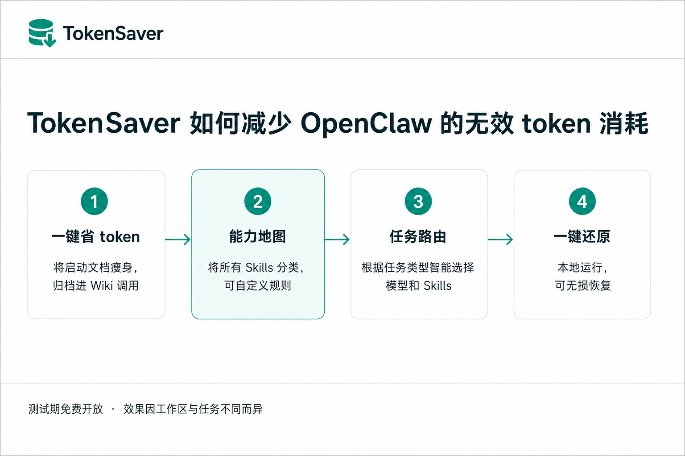

# ClawNexus TokenSaver

TokenSaver 是给 OpenClaw 用户准备的本地词元节约工具。

如果你的 OpenClaw 安装了很多 Skills，或者每次很简单的对话也会带上大量固定上下文，TokenSaver 可以帮你把这些重复、低价值的 token 消耗降下来。当前版本处于测试期，专家版能力免费开放。



## 现在可以做什么

### 一键省 token

检查 OpenClaw 的上下文结构，在保留可恢复备份的前提下，对启动文档做瘦身，并把适合归档的内容放到 Wiki 中按需调用。

### 能力地图（测试期开放）

整理本机 Skills，按能力域、输入对象、输出形态、触发线索等维度形成索引。你可以查看、分类、补全标签，也可以把不再需要的 Skill 禁用。

### 任务路由（测试期开放）

根据任务类型选择合适的模型和 Skills，避免每次都把全量 Skills 注入上下文。支持默认 Skill、备用队列、触发规则和路由健康度检查。

### 一键还原

所有高风险修改都会先做本地备份。需要重新测试、迁移或回到优化前状态时，可以通过 TokenSaver 执行恢复。

## 下载

请下载最新版：

[ClawNexus-TokenSaver-MCP-2026.5.22-testing.1.zip](https://github.com/tonyfenwick8814121/tokensaver/releases/download/v2026.5.22-testing.1/ClawNexus-TokenSaver-MCP-2026.5.22-testing.1.zip)

SHA256：

```text
10974fd802b0692df8d27bc965030f1a90ae8dea7e1ee80f7d98953a428b6629
```

完整版本记录见 [Releases](https://github.com/tonyfenwick8814121/tokensaver/releases)。

## 运行要求

- macOS，支持 Apple Silicon 和 Intel Mac
- Node.js 22.19 或更高版本
- OpenClaw 2026.5.12 到 2026.5.22

## 快速开始

1. 下载并解压 zip 包。
2. 双击 `启动 TokenSaver.command` 打开本地控制台。
3. 按页面提示先运行检查，再启用一键省 token。
4. 如果需要让 OpenClaw 识别 TokenSaver MCP，运行 `启动 MCP Server.command`。首次运行会自动写入 MCP 配置，后续启动会检查配置是否仍然正常。

如果 macOS 提示无法打开，请右键文件，选择“打开”。

## 测试期说明

测试期内，标准版和专家版能力都会开放。我们希望先收集更多真实工作区里的问题，再决定后续收费方式和正式版本边界。

测试期授权会在启动时自动获取。TokenSaver 会生成匿名 `install_id`，不会上传原始 MAC 地址。

## 隐私边界

TokenSaver 默认在本地运行，不上传你的 OpenClaw 文件、记忆文件、Skills、提示词或用户文档。

会访问 ClawNexus 服务的场景只有：

- 测试期授权
- 更新检查
- 问题反馈

详见 [PRIVACY.md](./PRIVACY.md)。

## 反馈问题

遇到问题时，优先使用 TokenSaver 内置的“问题与反馈”。这样会带上版本、系统和必要的诊断摘要，方便定位。

也可以在本仓库提交 Issue。反馈时请尽量说明：

- OpenClaw 版本
- TokenSaver 版本
- 你执行了哪个功能
- 发生了什么
- 你期望的结果是什么

## 重新测试或卸载

如果你想重新跑一遍完整流程，请先执行一键还原，再清理 TokenSaver 本地状态。

详细步骤见 [UNINSTALL.md](./UNINSTALL.md)。
